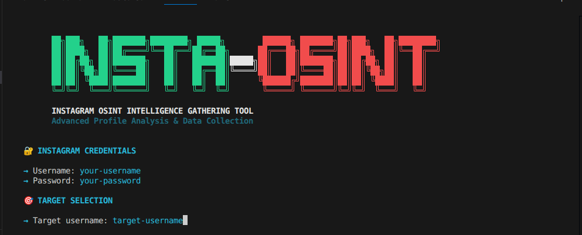
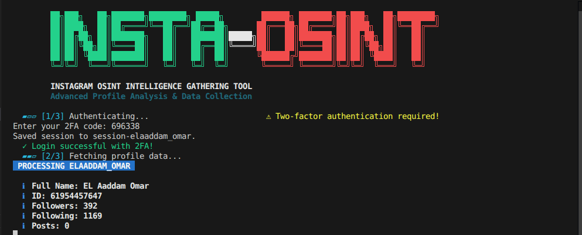
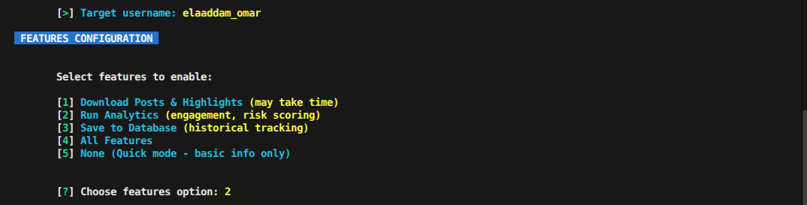
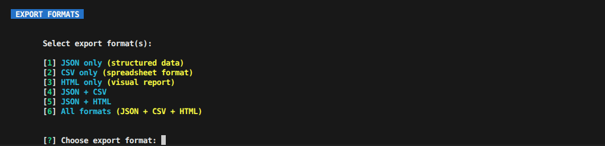
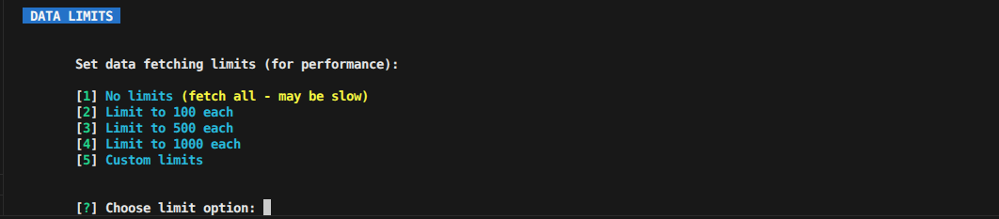
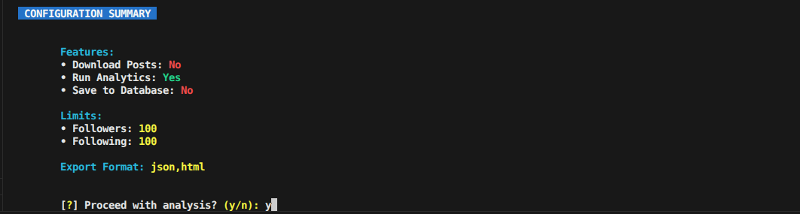
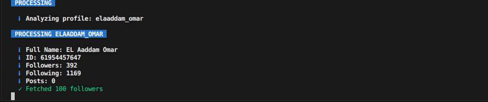
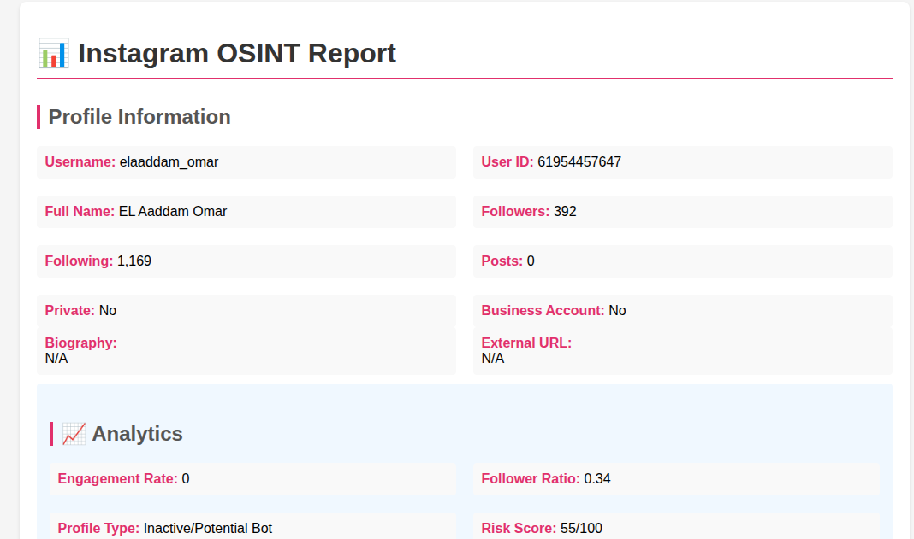

# 📸 Instagram OSINT Tool v2.0

> Advanced Open Source Intelligence gathering tool for Instagram with interactive menus, analytics engine, batch processing, and multi-format exports.

---

## 🌟 Overview

Instagram OSINT is a comprehensive intelligence gathering tool that combines session persistence, advanced analytics, database storage, and beautiful **interactive terminal UI** to analyze Instagram profiles efficiently. Whether you're a researcher, security analyst, or enthusiast, this tool provides powerful insights into Instagram account patterns and behaviors.

**Current Version:** 2.0.0  
**Last Updated:** December 2025  
**Interface:** Fully Interactive Menu System

---

## 📺 Terminal UI - Screenshots

### 1. Login Screen
Beautiful ASCII art banner with secure password input (hidden characters)



---

### 2. Two-Factor Authentication
Seamless 2FA support for protected accounts



---

### 3. Features Configuration Menu
Choose what you want to do - downloads, analytics, database storage



---

### 4. Export Format Selection
Multiple export options - JSON, CSV, HTML or all combined



---

### 5. Data Limits Configuration
Control how much data to fetch for performance optimization



---

### 6. Configuration Summary
Review your selections before processing begins



---

### 7. Profile Processing
Real-time progress indicators and colorful status messages



---

### 8. HTML Report Output
Beautiful interactive reports with all profile data



---

## ✨ Key Features

### 🎯 Interactive Menu System
- **No Command-Line Arguments Needed** - Everything is menu-driven
- **Step-by-Step Guidance** - Clear prompts for every decision
- **Visual Menus** - Colorful, numbered options
- **Input Validation** - Prevents errors with helpful messages
- **Confirmation Prompts** - Review settings before execution

### 🔐 Authentication & Security
- **Hidden Password Input** - Passwords never shown on screen
- **Two-Factor Authentication Support** - Handle 2FA seamlessly
- **Session Persistence** - Save sessions to avoid re-authentication
- **Smart Session Management** - Auto-load previous sessions

### 📊 Analytics Engine
- **Engagement Rate Calculation** - Followers per post metric
- **Follower Ratio Analysis** - Followers vs Following comparison
- **Risk Score Detection** - Identify suspicious accounts (0-100 scale)
- **Profile Classification** - Detect Business, Influencer, Bot, Regular accounts
- **Growth Tracking** - Historical data and trend analysis

### 📤 Export Capabilities
- **JSON Export** - Complete structured data with metadata
- **CSV Export** - Spreadsheet-ready format (profile, followers, following)
- **HTML Reports** - Interactive visual reports with styling
- **Multi-format Exports** - Export to multiple formats simultaneously

### 💾 Database Backend (SQLite)
- Store profile snapshots with timestamps
- Track follower/following changes over time
- Cache analytics results for quick queries
- Generate growth statistics and trends
- Historical profile comparisons

### 🔄 Batch Processing
- Process multiple profiles in single run
- Enter targets interactively or from file
- Compare profiles side-by-side
- Find mutual followers/following between accounts
- Rate-limited to respect Instagram API

### 🎨 Beautiful Terminal UI
- Colorful ASCII banner and messages
- Color-coded status indicators (✓ ✗ !)
- Loading animations and progress indicators
- Organized, readable output format
- Professional terminal interface

---

## 📋 Table of Contents

1. [Installation](#-installation)
2. [Quick Start](#-quick-start)
3. [Interactive Menu Guide](#-interactive-menu-guide)
4. [Features in Detail](#-features-in-detail)
5. [Export Formats](#-export-formats)
6. [Analytics Explained](#-analytics-explained)
7. [Database Features](#-database-features)
8. [Module Architecture](#-module-architecture)
9. [Legal & Disclaimer](#-legal--disclaimer)

---

## 🚀 Installation

### For Desktop/Laptop (Linux, macOS, Windows)

#### Prerequisites
- Python 3.8+
- pip package manager
- Instagram account (for authentication)

#### Setup

```bash
# Clone repository
git clone https://github.com/Adamo08/INSTA-OSINT.git
cd INSTA-OSINT

# Create virtual environment (recommended)
python3 -m venv venv
source venv/bin/activate  # On Windows: venv\Scripts\activate

# Install dependencies
pip install -r requirements.txt
```

---

### 📱 For Mobile (Android via Termux)

Yes! This tool works perfectly on Android phones using **Termux**!

#### Step 1: Install Termux
Download Termux from [F-Droid](https://f-droid.org/packages/com.termux/) (recommended) or Google Play Store

#### Step 2: Setup Termux Environment

```bash
# Update packages
pkg update && pkg upgrade

# Install required packages
pkg install python git

# Install pip
pip install --upgrade pip
```

#### Step 3: Clone and Setup

```bash
# Get storage permissions (optional, for saving files)
termux-setup-storage

# Clone repository
git clone https://github.com/Adamo08/INSTA-OSINT.git
cd INSTA-OSINT

# Install dependencies
pip install -r requirements.txt
```

#### Step 4: Run the Tool

```bash
python instaOSINT.py
```

#### 📱 Mobile Tips
- Use landscape mode for better visibility
- Swipe keyboard to navigate terminal
- Files are saved in `/storage/emulated/0/` if using termux-setup-storage
- Session files persist between runs (no need to login every time)
- Works on mobile data or WiFi
- Can run in background with Termux:Boot addon

#### Termux Keyboard Shortcuts
- `Volume Down + C` = Ctrl+C (cancel/exit)
- `Volume Down + L` = Clear screen
- `Volume Down + Z` = Suspend process

---

### Dependencies
- `instaloader` - Instagram scraping library
- Built-in Python libraries (no external dependencies for UI)

---

## ⚡ Quick Start

### Simply Run the Tool
```bash
python3 instaOSINT.py
```

**That's it!** The tool will guide you through everything with interactive menus.

### What Happens Next?

1. **🔐 Login Screen** - Enter your Instagram credentials (password is hidden)
2. **📋 Main Menu** - Choose what you want to do:
   - Single Profile Analysis
   - Batch Profile Analysis
   - Compare Profiles
   - View Database History
3. **⚙️ Configuration Menus** - Select features, export formats, and limits
4. **📊 Summary** - Review your choices
5. **🚀 Processing** - Watch real-time progress
6. **✅ Results** - Get exported files and analytics

---

## 🎮 Interactive Menu Guide

### Main Menu Options

When you run the tool, you'll see:
  -p mypassword \
  -t targetusername \
  --analyze \

**1. Single Profile Analysis** - Analyze one Instagram account
   - Download posts & highlights
   - Calculate analytics
   - Export in multiple formats

**2. Batch Profile Analysis** - Process multiple accounts
   - Enter usernames one by one
   - Or provide them via file
   - Process sequentially with rate limiting

**3. Compare Profiles** - Find connections between accounts
   - Mutual followers analysis
   - Profile similarity scoring
   - Network mapping

**4. View Database History** - Check stored data
   - Query past analyses
   - View growth statistics
   - Export historical reports

**5. Exit** - Close the tool

### Features Configuration Menu

After selecting a profile, configure what to do:

**1. Download Posts & Highlights** ⚠️ May take time
   - Downloads all media from profile
   - Saves to local directory

**2. Run Analytics** 📊 Calculate metrics
   - Engagement rate
   - Follower ratio
   - Risk scoring
   - Profile classification

**3. Save to Database** 💾 Track history
   - Store profile snapshot
   - Enable growth tracking
   - Historical comparisons

**4. All Features** - Enable everything above

**5. None (Quick Mode)** - Basic info only
   - Fast execution
   - Just profile metadata
   - No downloads or analytics

### Export Format Menu

Choose how to save your data:

**1. JSON only** - Structured data format
**2. CSV only** - Spreadsheet format (3 files)
**3. HTML only** - Visual report in browser
**4. JSON + CSV** - Both formats
**5. JSON + HTML** - Structured + Visual
**6. All formats** - JSON + CSV + HTML (recommended)

### Data Limits Menu

Control performance by limiting data fetched:

**1. No limits** - Fetch everything (slow for large accounts)
**2. Limit to 100 each** - Quick analysis
**3. Limit to 500 each** - Balanced
**4. Limit to 1000 each** - Comprehensive
**5. Custom limits** - Enter your own numbers

---

## 🎯 Step-by-Step Walkthrough

### Example: Analyzing a Single Profile

1. **Start the tool:**
   ```bash
   python3 instaOSINT.py
   ```

2. **Login** (first time or if session expired):
   - Enter your Instagram username
   - Enter password (hidden input - you won't see characters)
   - If 2FA is enabled, enter the 6-digit code

3. **Main Menu appears:**
   - Select **[1] Single Profile Analysis**

4. **Enter target:**
   - Type the username you want to analyze
   - Example: `targetusername`

5. **Features Configuration:**
   - Select **[2] Run Analytics** for metrics
   - Or **[4] All Features** for complete analysis

6. **Export Format:**
   - Select **[6] All formats** for complete export

7. **Data Limits:**
   - Select **[3] Limit to 500 each** for balanced performance

8. **Configuration Summary:**
   - Review your selections
   - Confirm to proceed (y/n)

9. **Processing:**
   - Watch real-time progress indicators
   - Colored status messages show each step
   - ✓ marks successful completion

10. **Results:**
    - Files exported to current directory
    - Open HTML report in browser
    - Check JSON for structured data
    - Import CSV into spreadsheet

---

## 🔄 Batch Processing Example

Process multiple accounts efficiently:

1. **Create targets file:**
   ```bash
   cat > targets.txt << EOF
   username1
   username2
   username3
   EOF
   ```

2. **Run tool:**
   ```bash
   python3 instaOSINT.py
   ```

3. **Select [2] Batch Profile Analysis**

4. **Choose input method:**
   - Select "Load from file"
   - Enter filename: `targets.txt`

5. **Configure options:**
   - Features: **[2] Run Analytics**
   - Export: **[1] JSON only**
   - Limits: **[2] Limit to 100 each** (for speed)

6. **Watch processing:**
   - Progress: [1/3], [2/3], [3/3]
   - Each profile processed sequentially
   - 2-second delay between profiles (rate limiting)

7. **Results:**
   - 3 JSON files created (one per profile)
   - Summary statistics displayed
   - All data in database if enabled

---

## 💡 Usage Tips

### Best Practices

**For Quick Analysis:**
- Use **Quick Mode** (Feature option 5)
- Set **Limit to 100** on followers/following
- Export **JSON only**

**For Comprehensive Research:**
- Enable **All Features**
- Use **No Limits** (option 1)
- Export **All formats**
- Enable **Database storage**

**For Large Accounts (100K+ followers):**
- Use **Custom Limits** with reasonable numbers
- Skip downloads (**Quick Mode**)
- Process during off-peak hours

**For Regular Monitoring:**
- Enable **Database storage**
- Run weekly/monthly
- Use **Quick Mode** for speed
- Track growth via database queries

### Session Management

**First Run:**
- Requires username + password
- 2FA if enabled
- Session saved automatically

**Subsequent Runs:**
- Session auto-loaded
- No password needed
- No 2FA prompt
- Instant authentication ✓

**Clear Sessions:**
```bash
rm session-*
```

---

## 🎯 Features in Detail

### Session Persistence
Automatically saves authentication sessions to `session-{username}` files.

**Benefits:**
- No need to re-enter credentials
- Skip 2FA on subsequent runs
- Faster authentication
- Secure token storage

**How it works:**
```
First Run:  Username + Password → Authenticate → Save Session
Second Run: Load Session → Authenticate Instantly ✓
```

### Two-Factor Authentication
Seamlessly handles 2FA protected accounts.

**Process:**
1. Script detects 2FA requirement
2. Prompts for 6-digit code
3. Accepts code from authenticator app or SMS
4. Saves session with 2FA tokens
5. Future runs skip 2FA entirely

### Security Features
- **Hidden Password Input** - Uses getpass module, no echo
- **Session Encryption** - Tokens stored securely
- **No Password Storage** - Never saves plain-text passwords
- **Local Session Files** - No cloud storage

### Error Handling
Graceful error handling for:
- Non-existent profiles
- Private accounts (limited data)
- Rate limiting (automatic delays)
- Network errors
- Invalid credentials

---

## 💾 Database Features

### Automatic Database Creation
First run creates `osint_data.db` with optimized schema.

### Tables

#### profiles
Snapshots of profile metadata:
- Username, user ID, full name
- Bio, external URL
- Privacy settings, account type
- Follower/following/post counts
- Timestamps

#### followers
Historical follower records:
- Profile being followed
- Follower details (username, ID, name)
- Timestamp of recording

#### profile_history
Growth tracking over time:
- Follower count snapshot
- Following count snapshot
- Post count snapshot
- Recorded timestamp

#### analytics_cache
Cached analytics results:
- Engagement metrics
- Risk scores
- Profile classification
- Calculation timestamp

### Growth Tracking Example

Run the same profile analysis periodically:

```bash
# Day 1
python3 instaOSINT.py -u myuser -p mypass -t target --db

# Day 7 (one week later)
python3 instaOSINT.py -u myuser -p mypass -t target --db
```

Database automatically tracks changes. Query growth:
```python
from database import OsintDatabase
db = OsintDatabase()
growth = db.get_growth_stats('target')
print(f"Follower change: +{growth['followers_change']}")
```

📸 **SCREENSHOT**: Show osint_data.db file in file explorer and terminal output showing growth statistics query result

---

## 📤 Export Formats

### JSON Export
**File:** `{username}_data_YYYYMMDD_HHMMSS.json`

**Sample Structure:**
```json
{
  "export_date": "2025-12-30T12:34:56.789000",
  "profile": {
    "username": "targetuser",
    "full_name": "Target User Name",
    "user_id": 123456789,
    "biography": "User bio",
    "followers_count": 5000,
    "following_count": 1200,
    "posts_count": 250
  },
  "followers": [
    {"username": "follower1", "user_id": 111111111, "full_name": "Follower Name"}
  ],
  "following": [...],
  "analytics": {
    "engagement_rate": 2.5,
    "follower_ratio": 4.17,
    "risk_score": 12,
    "profile_type": "Influencer"
  }
}
```

📸 **SCREENSHOT**: Open JSON file in text editor and show formatted output (capture first 50 lines)

### CSV Export
**Files Generated:**
- `{username}_profile_TIMESTAMP.csv` - Profile metadata
- `{username}_followers_TIMESTAMP.csv` - Followers list
- `{username}_following_TIMESTAMP.csv` - Following list

📸 **SCREENSHOT**: Show file explorer with all three CSV files generated

### HTML Report
**File:** `{username}_report_YYYYMMDD_HHMMSS.html`

**Features:**
- Professional styling with Instagram branding
- Profile information card
- Analytics dashboard
- Responsive design
- Searchable tables
- Print-friendly layout

📸 **SCREENSHOT**: Open HTML report in web browser (Firefox/Chrome) showing full page with profile info, analytics section, and tables

---

## 📊 Analytics Explained

### Engagement Rate
```
Formula: Followers / Posts
```

**Example:** 1000 followers / 100 posts = 10 followers per post

### Follower Ratio
```
Formula: Followers / Following
```

**Example:** 1000 followers / 200 following = 5.0 ratio

### Risk Score (0-100)
Calculated risk of account being suspicious, bot, or fake.

**Factors:**
- Very high following count (following 2x+ followers)
- No posts but many followers (bot indicator)
- Extremely low engagement
- Private with unusual follower growth

### Profile Type Classification
- **Business Account** - Has business category set
- **Influencer** - 10,000+ followers
- **Private Account** - Privacy enabled
- **Regular Account** - Standard user
- **Inactive/Potential Bot** - 0 posts despite followers

### Example Analytics Output

```
📊 ANALYTICS
━━━━━━━━━━━━━━━━━━━━━━━━━━━━━━━━━━━━━━━━━
✓ Profile Type        : Influencer
✓ Engagement Rate     : 2.5
✓ Follower Ratio      : 4.17
✓ Risk Score          : 15/100 (Low Risk)
✓ Posts per Follower  : 0.05
✓ Following %         : 24.0%
━━━━━━━━━━━━━━━━━━━━━━━━━━━━━━━━━━━━━━━━━
```

📸 **SCREENSHOT**: Run analysis with `--analyze` and capture the colorful analytics output section

---

## 🏗️ Module Architecture

### processor.py
Core OSINT operations including authentication, profile fetching, batch processing, and export coordination.

### analyzer.py
Analytics calculations including engagement metrics, risk scoring, profile classification, and comparative analysis.

### exporter.py
Multi-format export supporting JSON, CSV, and HTML report generation with professional formatting.

### database.py
SQLite backend for persistent storage, historical tracking, and growth statistics.

### cli.py
Command-line interface with argument parsing, validation, and comprehensive help documentation.

### utils.py
Helper functions for colored output, formatting, animations, and status messages.

---

## 💡 Examples

### Example 1: Analyze Single Influencer

```bash
python3 instaOSINT.py \
  -u myusername \
  -p mypassword \
  -t cristiano \
  --analyze \
  -o json,html
```

**Note:** When running interactively, passwords are **hidden** for security (masked input).

📸 **SCREENSHOT**: Run this command and capture console showing analysis results with colorful output

### Example 2: Batch Processing from File

```bash
cat > targets.txt << EOF
username1
username2
username3
EOF

python3 instaOSINT.py \
  -u myusername \
  -p mypassword \
  -f targets.txt \
  --analyze \
  --db
```

📸 **SCREENSHOT**: Capture the batch processing progress showing all three profiles being processed

### Example 3: Track Growth Over Time

```bash
# Day 1
python3 instaOSINT.py -u myuser -p mypass -t target --db

# Day 8
python3 instaOSINT.py -u myuser -p mypass -t target --db

# Query results
python3 << 'EOF'
from database import OsintDatabase
db = OsintDatabase()
growth = db.get_growth_stats('target')
print(growth)
EOF
```

📸 **SCREENSHOT**: Show the Python query output displaying growth statistics

### Example 4: Multi-Format Export

```bash
python3 instaOSINT.py \
  -u myusername \
  -p mypassword \
  -t targetusername \
  -o json,csv,html \
  --analyze
```

📸 **SCREENSHOT**: Show file explorer with all exported files (JSON, 3 CSVs, HTML)

---

## 🔧 CLI Reference

### Full Help
```bash
python3 instaOSINT.py --help
```

### Essential Arguments

```bash
# Authentication
-u, --username USERNAME      Your Instagram username
-p, --password PASSWORD      Your Instagram password
--no-session                 Don't use saved sessions

# Target Selection  
-t, --target TARGET          Single target username
-f, --file FILE              File with target list

# Output Options
-o, --output OUTPUT          Export formats: json,csv,html
-d, --dir DIR               Output directory

# Features
--db                         Store in database
--analyze                    Calculate analytics
--compare                    Compare profiles
--no-download               Skip downloads

# Performance
--limit-followers N          Max followers to fetch
--limit-following N          Max following to fetch
--quiet                     Minimize output
```

📸 **SCREENSHOT**: Capture the help output from `python3 instaOSINT.py --help`

---

## 🎨 Terminal Output Examples

### Login & Authentication
```
📱 Instagram OSINT Tool v2.0
━━━━━━━━━━━━━━━━━━━━━━━━━━━━

[+] LOGIN YOUR INSTAGRAM ACCOUNT

Enter Instagram username: myusername
Enter Instagram password: ••••••••

[✓] Session loaded successfully!
[✓] Login successful!
```

📸 **SCREENSHOT**: Capture the colorful login screen with ASCII art banner

### Profile Analysis Output
```
📊 PROCESSING targetusername
━━━━━━━━━━━━━━━━━━━━━━━━━━━━━━━━━━━━

[+] Full Name: Target User Name
[+] ID: 123456789
[+] Followers: 5,000
[+] Following: 1,200
[+] Posts: 250

[✓] Fetched 5000 followers
[✓] Fetched 1200 following

📊 ANALYTICS
━━━━━━━━━━━━━━━━━━━━━━━━━━━━━━━━━━━━
[+] Profile Type: Influencer
[+] Engagement Rate: 2.5
[+] Follower Ratio: 4.17
[+] Risk Score: 15/100 (Low Risk)

[✓] Exported to: targetuser_data_20251230_123456.json
```

📸 **SCREENSHOT**: Run a profile analysis and capture full colored output

### Batch Processing Progress
```
🔄 BATCH PROCESSING 3 PROFILES
━━━━━━━━━━━━━━━━━━━━━━━━━━━━━

[1/3] Processing username1...
✓ Completed in 15s

[2/3] Processing username2...
✓ Completed in 12s

[3/3] Processing username3...
✓ Completed in 18s

✓ Batch complete! Total: 45s
✓ All data saved to database
```

📸 **SCREENSHOT**: Run batch processing and capture the progress output

---

## 📋 Requirements

### System Requirements
- Python 3.8 or higher
- 50MB disk space minimum
- Internet connection
- Instagram account

### Python Dependencies
```
instaloader>=4.12.0
requests>=2.28.0
```

---

## ⚙️ Configuration

### Session Files
Sessions stored as: `session-{username}`

**Clear sessions:**
```bash
rm session-*
```

### Database File
Auto-created as: `osint_data.db`

**Reset database:**
```bash
rm osint_data.db
```

### Output Directory
```bash
python3 instaOSINT.py -u user -p pass -t target -d /custom/path
```

---

## 🔒 Security & Best Practices

### Password Security
✅ **Interactive Mode:**
- Passwords are **masked** during input (not visible on screen)
- Uses Python's `getpass` module for secure input
- Characters replaced with dots/asterisks
- No password echoing to terminal

✅ **CLI Mode:**
- Pass credentials via command-line arguments
- Credentials not stored in shell history (use space prefix on some shells)
- Session tokens stored locally only

### Credentials Handling
- Never commit passwords to version control
- Use environment variables for automation
- Session tokens are local only
- Use your own account

### Rate Limiting
- Tool adds automatic delays between requests
- Don't run multiple instances simultaneously
- Respect Instagram's Terms of Service
- Monitor for IP blocks

### Data Privacy
- Content stored locally
- Database contains snapshots
- Export files are not encrypted
- Clean up old files regularly

---

## ⚠️ Legal & Disclaimer

**This tool is for educational and authorized research purposes only.**

### Important
1. **Terms of Service**: Using this may violate Instagram's ToS
2. **Legal Compliance**: Follow all applicable laws
3. **No Liability**: Authors not responsible for consequences
4. **Authorization Only**: Analyze accounts you have permission for

### Responsible Use
- ✅ Analyze your own accounts
- ✅ Authorized competitor research
- ✅ Permission-based security audits
- ❌ Don't scrape private accounts
- ❌ No harassment or stalking
- ❌ Don't violate ToS

---

## 🆘 Troubleshooting

### Login Issues
- Check username/password
- Try `--no-session` flag
- Verify 2FA code if required

### Profile Not Found
- Verify username spelling
- Check if account deleted
- Private accounts have limited data

### Database Errors
- Close other instances
- Delete `osint_data.db` to reset

### Rate Limiting
- Wait 30-60 minutes
- Reduce batch sizes
- Use `--limit-followers` option

---

## 🤝 Contributing

Contributions welcome! Please:
1. Fork the repository
2. Create feature branch
3. Make improvements
4. Submit pull request

### Ideas for Contribution
- Additional export formats (XML, PDF)
- Advanced analytics and predictions
- Web UI dashboard
- Performance improvements
- Bug fixes

---

## 📝 Changelog

### v2.0.0 (Current - December 2025)
**Major Rewrite**
- ✨ Complete modular refactoring (6 specialized modules)
- ✨ Advanced CLI argument parsing
- ✨ Batch processing with file input
- ✨ SQLite database backend
- ✨ Multi-format exports (JSON, CSV, HTML)
- ✨ Professional analytics engine
- ✨ Enhanced terminal UI
- ✨ Profile comparison and analysis
- 🐛 Improved error handling
- 🐛 Better rate limiting

### v1.0.0 (Original)
- Basic profile analysis
- Follower/following retrieval
- JSON export
- Post downloading
- 2FA support

---

## 📮 Support

### Having Issues?
1. Check [Troubleshooting](#-troubleshooting)
2. Review GitHub issues
3. Create new issue with details

### Questions?
See examples and documentation above.

---

## 📄 License

Original author: **HUNX04**  
v2.0 modernization and features

Respect original creator's terms.

---

## 📞 Contact

**Original Author:** HUNX04  
**Repository:** [INSTA-OSINT](https://github.com/HunxByts/INSTA-OSINT)

---

## ⭐ Support

If useful, please:
- ⭐ Star the repository
- 🐛 Report bugs
- 💡 Suggest features
- 📤 Share with others
- 🤝 Contribute code

---

**Made with ❤️ for the OSINT Community**

**Last Updated:** December 30, 2025  
**Version:** 2.0.0  
**Status:** Production Ready
